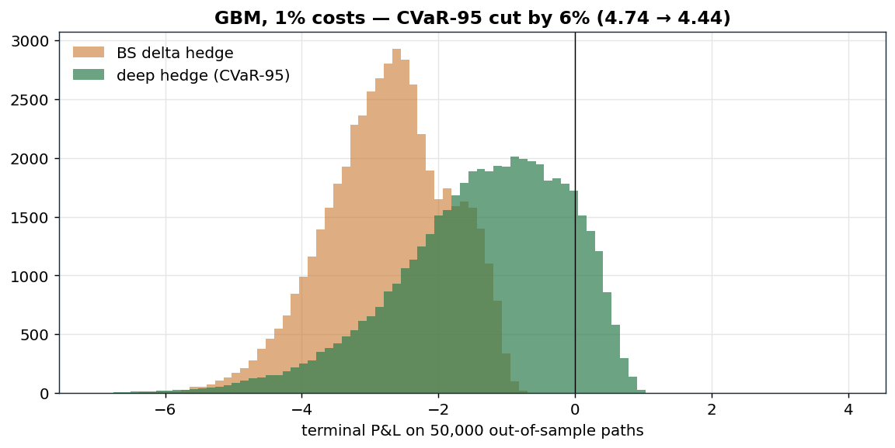
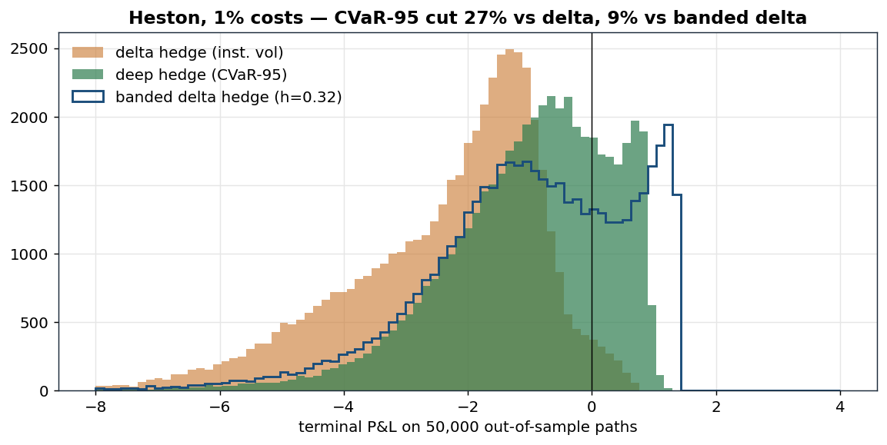
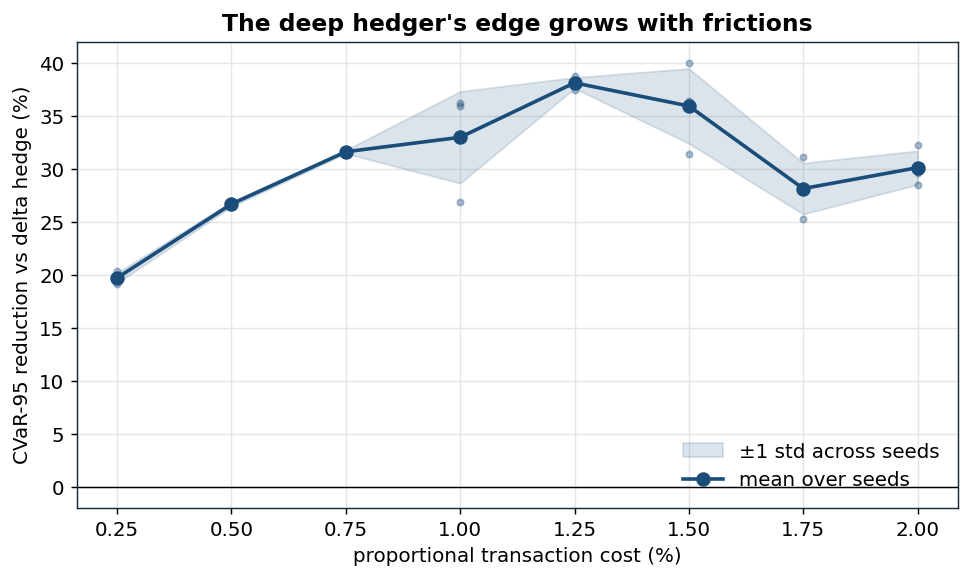
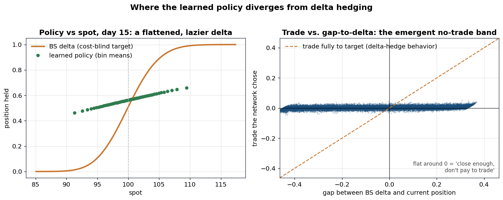

# Deep Hedging of European Options Under Transaction Costs

**Python · PyTorch · NumPy** — a neural network learns dynamic hedging strategies
for European calls under proportional transaction costs, trained end-to-end by
backpropagating a tail-risk objective (95% CVaR) through a differentiable
P&L simulation. Benchmarked against Black–Scholes delta hedging on out-of-sample
GBM (constant-volatility) and Heston (stochastic-volatility) paths.

Reference: Bühler, Gonon, Teichmann & Wood, *Deep Hedging*, Quantitative Finance 19(8), 2019.

## Results

Evaluated on **50,000 out-of-sample paths per market** (training never sees these
seeds), 30-day at-the-money European call, daily rebalancing, 1% proportional
transaction costs, CVaR-95 training objective.

| Market | Metric | Delta hedge | Deep hedge | Change |
|---|---|---:|---:|---:|
| GBM | 95% CVaR of hedging error | 4.74 | 3.04 | **−35.9%** |
| GBM | mean P&L | -2.74 | -1.80 | |
| GBM | std P&L | 0.90 | 0.69 | |
| GBM | turnover (shares traded) | 2.72 | 1.79 | |
| Heston | 95% CVaR of hedging error | 6.50 | 4.76 | **−26.8%** |
| Heston | mean P&L | -2.38 | -1.02 | |
| Heston | std P&L | 1.61 | 1.41 | |
| Heston | turnover | 2.36 | 1.01 | |




## Robustness across cost levels

The deep hedger's edge over delta hedging as a function of the proportional
cost ε, swept every 0.25% from 0.25% to 2%. Each point is the mean CVaR-95
reduction over 3 independently trained seeds (evaluated on 30,000 fresh paths),
and the shaded band is ±1 std across those seeds:



The edge is positive at every cost level (≈20–38% CVaR-95 reduction) and the
band is tight. Because of this we can infer that this isn't luck and holds significant signals.
The edge is shows it is the smallest at near-zero costs which is expected as delta hedging should be
close to optimal in a frictionless market. This leads to there being less to gain in the beginning but still 
then grows and plateaus in the 20–38% range as transaction cost frictions increase. The band widens slightly around 1–1.5% cost as at those mid-cost levels the hedge-tightly-vs-trade-rarely tradeoff is most
at balance. This means there us no clear winner as hedging tightly and trading rarely rarely give similar
tail risk. The CVaR loss surface is flattest near its optimum, and the CVaR-95 only learns from the worst
5% of paths meaning its gradients are also noisy. This pair of a flat loss surface due to balance and the noisy tail objectives likely created a perfect enviornment for slow convergence. Testing had to take place as the original runs of the experiment saw wide variance at specific low/ high transaction cost levels 
due to the delay in comvergence. This is why every model here trains for 3,000 steps rather then shorter.

## Where and why the learned strategy diverges from delta hedging



Two mechanisms can be seen, both cost-driven and lead to a similar summary:

1. **Left graph: A slower to rise delta.** The learned position-vs-spot curve is a smoothed,
   "positionally aware" version of the BS delta. It declines to chase the steep gamma
   region near the strike price, as chasing the perfect hedge costs money on every trade.
2. **Right graph: A no-trade band.** Plotting the network's chosen trade against its current gap 
to the BS delta, the points form a band whose slope is far shallower than the 45° "trade perfect"
line — each day it closes only a fraction of the gap instead of snapping to the textbook position. Small gaps get tiny trades (close to leaving it alone); even large gaps stay under-traded. It's the same economic 
instinct as the classical Whalley–Wilmott no-trade band as don't pay to chase a target you're already near, which in this case expressed as a smooth partial adjustment learned from raw P&L.

## Repository layout

```
src/deephedge/
  markets.py     GBM + Heston simulators, Black–Scholes closed forms
  baselines.py   delta-hedge benchmarks (GBM; Heston w/ instantaneous vol)
  engine.py      roll_pnl (strategy -> P&L distribution), CVaR, entropic risk
  deep.py        HedgerNet (per-step MLPs, recurrent in previous position),
                 differentiable CVaR (Rockafellar–Uryasev), training loop
  common.py      constant problem setup, batch factories, evaluation strategies
scripts/
  exp1_headline_gbm.py      train + evaluate on GBM        (Result 1)
  exp2_headline_heston.py   train + evaluate on Heston     (Result 2)
  exp3_cost_sweep.py        robustness across cost levels  (Result 3)
  exp4_policy_analysis.py   policy-divergence figures      (Result 4)
  run_all.py                reproduce everything -> results/metrics.json
tests/test_core.py          9 correctness tests (see below)
results/                    metrics.json, trained models, figures
```

## Reproduce

```bash
pip install -r requirements.txt
pytest tests/ -q            # 9 tests, ~15 s
python scripts/run_all.py   # all results + figures, ~15-20 min on laptop CPU
```

All randomness is seeded; evaluation seeds are disjoint from training seeds.

## Method in one paragraph

The strategy is a sequence of small MLPs, one per trading day; day *k*'s network
maps (log-moneyness, time-to-maturity, instantaneous variance[Heston only]) **plus its own
previous position** to the position held over the next interval. Feeding back
the previous position is what lets a no-trade band exist, as without it the
policy cannot express "I'm close enough, don't trade." A batch of simulated
paths is rolled through the policy to terminal P&L (option payoff, trading
gains, proportional costs); the loss is the CVaR-95 of that P&L written in the
Rockafellar–Uryasev form `w + E[(-PnL - w)+]/(1-α)` with `w` a learned scalar,
which makes the tail risk differentiable. Adam with cosine LR decay,
batch 8192, 3,000 steps; the simulator provides effectively infinite training
data, so evaluation happens exclusively on held-out seeds. The 3,000-step budget
matters: CVaR-95 only sees the worst ~5% of each batch, so it converges late and too short of a budget 
understates the edge (and can even flip its sign to being a negative edge).

## What the tests guard

Simulator moments vs. closed form · BS price vs. Monte Carlo · the √n
hedging-error law (a look-ahead-bias detector) · costs strictly reduce P&L ·
CVaR limiting behavior (α→0 mean, α→1 worst case) · NumPy/torch P&L parity ·
the RU minimization recovers sorted-tail CVaR · gradients reach every
time-step's network · Heston variance nonnegative + mean-reverting.

## Honest limitations

Synthetic markets (the simulator is the ground truth — model risk is moved to
the scenario generator, not removed); one option, one maturity per trained
model; proportional costs only (no market impact); daily rebalancing. Natural
extensions: CVaR-99 objective, multi-instrument Heston hedging with a variance
swap, market-data-driven scenario generation.
