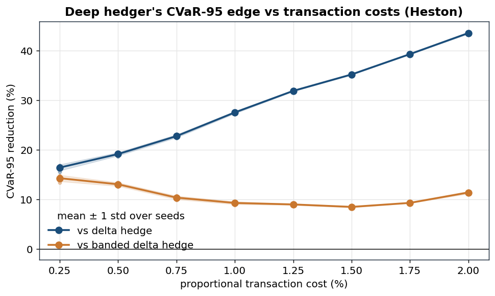

# Deep Hedging of European Options Under Transaction Costs

**Python · PyTorch · NumPy** — a neural network learns dynamic hedging strategies
for European calls under proportional transaction costs, trained end-to-end by
backpropagating a tail-risk objective (95% CVaR) through a differentiable
P&L simulation. Benchmarked against Black–Scholes delta hedging and a tuned
no-trade-band delta hedge on out-of-sample GBM (constant-volatility) and Heston
(stochastic-volatility) paths.

Reference: Bühler, Gonon, Teichmann & Wood, *Deep Hedging*, Quantitative Finance 19(8), 2019.

## Results

Evaluated on **50,000 out-of-sample paths per market** (training never sees these
seeds), 30-day at-the-money European call, daily rebalancing, 1% proportional
transaction costs, CVaR-95 training objective.

Two benchmarks:

- **Delta hedge:** rebalance to the Black–Scholes delta every day (at the current
  instantaneous vol on Heston). This is the textbook benchmark, but it ignores costs.
- **Banded delta hedge:** BS delta at 20% vol with a no-trade band. The position is only
  adjusted when it drifts more than *h* shares from the delta, and then only back to the
  edge of the band (Whalley–Wilmott style). *h* is tuned for each cost on separate
  paths, so like the deep hedger it never sees the evaluation paths. This is the harder,
  cost-aware benchmark.

| Market | Metric | Delta hedge | Banded delta | Deep hedge | vs delta | vs banded |
|---|---|---:|---:|---:|---:|---:|
| GBM | 95% CVaR of hedging error | 4.74 | 3.39 | 3.04 | **−35.8%** | **−10.3%** |
| GBM | mean P&L | -2.74 | -1.59 | -1.80 | | |
| GBM | std P&L | 0.90 | 0.84 | 0.69 | | |
| GBM | turnover (shares traded) | 2.72 | 1.58 | 1.79 | | |
| Heston | 95% CVaR of hedging error | 6.50 | 5.25 | 4.76 | **−26.8%** | **−9.3%** |
| Heston | mean P&L | -2.38 | -1.00 | -1.02 | | |
| Heston | std P&L | 1.61 | 1.67 | 1.41 | | |
| Heston | turnover | 2.36 | 0.98 | 1.01 | | |

Band half-width *h* = 0.10 (GBM) and 0.32 (Heston). Mean P&L is negative for every
strategy because the option is sold at its frictionless fair price, so transaction costs
are an uncovered expense. Mean P&L ≈ −1% × S₀ × turnover. Most of the gain over the plain
delta hedge comes from trading less, and a simple no-trade band captures most of that too.
The deep hedger's remaining ≈10% edge over the band is in the **tail**: it has the lowest
std and CVaR in both markets, while trading slightly more than the band (13% more on GBM,
3% more on Heston). For reference, not hedging at all gives CVaR-95 of 10.09 (GBM) and
6.99 (Heston).


## Robustness across cost levels

### GBM

The deep hedger's CVaR-95 reduction on **GBM paths** against both benchmarks, as a function of
the proportional cost ε, swept every 0.25% from 0.25% to 2%. Each point is the mean over 3
independently trained seeds (evaluated on 30,000 fresh paths), the faint dots are the
individual seeds, and the shaded band is ±1 std across them. The no-trade band width is
re-tuned at every cost level:


| cost ε | 0.25% | 0.5% | 0.75% | 1% | 1.25% | 1.5% | 1.75% | 2% |
|---|---:|---:|---:|---:|---:|---:|---:|---:|
| delta hedge CVaR-95 | 1.74 | 2.71 | 3.71 | 4.74 | 5.78 | 6.83 | 7.81 | 8.85 |
| banded delta CVaR-95 (*h*) | 1.55 (0.04) | 2.20 (0.06) | 2.80 (0.08) | 3.38 (0.10) | 3.93 (0.12) | 4.50 (0.12) | 5.03 (0.14) | 5.50 (0.14) |
| deep hedge CVaR-95 | 1.40 | 1.99 | 2.53 | 3.17 | 3.57 | 4.37 | 5.61 | 6.18 |
| reduction vs delta | 19.7% | 26.7% | 31.7% | 33.0% | 38.2% | 36.0% | 28.2% | 30.2% |
| reduction vs banded | 9.7% | 9.7% | 9.5% | 6.1% | 9.2% | 2.9% | −11.5% | −12.5% |

**Against the cost-blind delta hedge**, the edge is 20–38% at every cost level. That number
mostly reflects how expensive the delta hedge's daily rebalancing is, not how good the deep
hedger is.

**Against the banded delta hedge**, the deep hedger is a steady ≈10% better from 0.25% to
1.25%, with tight seed agreement at most of those levels. Above that it breaks down. At 1%
and 1.5% one seed out of three lands well below the others, and at 1.75–2% all three seeds
are **worse than the band by ≈12%**. The deep hedger's CVaR jumps from 4.37 to 5.61 between
1.5% and 1.75%, while the band's rises smoothly. That kink points to an optimization
failure, not a real limit: a network that sees its previous position can represent a
no-trade band, but at high costs training doesn't find it within 3,000 steps. The same
failure explains why the curve against the delta hedge peaks at 1.25% and falls back.

A likely reason training struggles here is that at mid-to-high costs, hedging tightly and
trading rarely give similar tail risk. The CVaR objective is then flat near its optimum, and
CVaR-95 learns from only the worst 5% of paths in each batch, so its gradients are noisy. A
flat objective with noisy gradients slows convergence. Early short runs showed large
seed-to-seed variance at these cost levels, which is why every model trains for 3,000 steps.
The high-cost results suggest even that is not enough on GBM.

### Heston

The same sweep on **Heston paths**, with an identical protocol (cost grid, 3 seeds, 30,000
evaluation paths, 3,000 training steps). The delta hedge uses the current instantaneous vol,
and the deep hedger also sees V_t:



| cost ε | 0.25% | 0.5% | 0.75% | 1% | 1.25% | 1.5% | 1.75% | 2% |
|---|---:|---:|---:|---:|---:|---:|---:|---:|
| delta hedge CVaR-95 | 4.19 | 4.91 | 5.74 | 6.48 | 7.36 | 8.21 | 9.19 | 10.18 |
| banded delta CVaR-95 (*h*) | 4.09 (0.14) | 4.57 (0.18) | 4.95 (0.20) | 5.17 (0.32) | 5.50 (0.32) | 5.82 (0.32) | 6.15 (0.32) | 6.48 (0.32) |
| deep hedge CVaR-95 | 3.50 | 3.97 | 4.44 | 4.69 | 5.01 | 5.32 | 5.58 | 5.74 |
| reduction vs delta | 16.4% | 19.2% | 22.8% | 27.6% | 31.9% | 35.2% | 39.3% | 43.6% |
| reduction vs banded | 14.3% | 13.0% | 10.4% | 9.3% | 9.0% | 8.5% | 9.3% | 11.4% |

**Against the delta hedge** the edge climbs to 44%, but that's mostly a weak benchmark.
These Heston parameters (from Bühler et al.) badly violate the Feller condition
(2αb = 0.08 ≪ σ_v² = 4), so the instantaneous vol is below 1% on ≈47% of path-days
(`frac_days_vol_below_1pct` in `metrics.json`). When it is, the instantaneous-vol delta acts
like a 0/1 step function and flips whenever the price crosses the strike. From 1.25% cost
upward its CVaR-95 is **worse than not hedging at all** (7.36 vs 6.87 at 1.25%, 10.18 vs 6.89
at 2%; `no_hedge_cvar95` in `sweep_heston.json`). On GBM the delta hedge always beats not
hedging (no-hedge CVaR-95 ≈ 10.1).

**Against the banded delta hedge** the edge is a stable 8.5–14% at every cost level, with
seeds agreeing to within 0.6pp. It is largest at low cost (14% at 0.25%) because part of it
has nothing to do with costs. The deep hedger also sees V_t and optimizes CVaR directly
against the volatility risk that the stock alone cannot hedge, which matters even when
trading is nearly free. Unlike GBM, the three seeds agree closely at every cost level here.

## Where and why the learned strategy diverges from delta hedging


Two mechanisms can be seen, both cost-driven and lead to a similar summary:

1. **Left graph: A slower to rise delta.** The learned position-vs-spot curve is a smoothed,
   "positionally aware" version of the BS delta. It declines to chase the steep gamma
   region near the strike price, as chasing the perfect hedge costs money on every trade.
2. **Right graph: A no-trade band.** Plotting the network's chosen trade against its current gap 
to the BS delta, the points form a band whose slope is far shallower than the 45° "trade perfect"
line — each day it closes only a fraction of the gap instead of snapping to the textbook position. Small gaps get tiny trades (close to leaving it alone); even large gaps stay under-traded. It's the same economic 
instinct as the classical Whalley–Wilmott no-trade band as don't pay to chase a target you're already near, which in this case expressed as a smooth partial adjustment learned from raw P&L.

## Repository layout

```
src/deephedge/
  markets.py     GBM + Heston simulators, Black–Scholes closed forms
  baselines.py   delta-hedge benchmarks (GBM; Heston w/ instantaneous vol),
                 no-trade-band delta hedge + band-width tuning
  engine.py      roll_pnl (strategy -> P&L distribution), CVaR, entropic risk
  deep.py        HedgerNet (per-step MLPs, recurrent in previous position),
                 differentiable CVaR (Rockafellar–Uryasev), training loop
  common.py      constant problem setup, batch factories, evaluation strategies
scripts/
  exp1_headline_gbm.py      train + evaluate on GBM        (Result 1)
  exp2_headline_heston.py   train + evaluate on Heston     (Result 2)
  exp3_cost_sweep.py        robustness across cost levels, GBM   (Result 3)
  exp4_policy_analysis.py   policy-divergence figures      (Result 4)
  exp5_cost_sweep_heston.py robustness across cost levels, Heston (Result 5)
  run_all.py                reproduce everything -> results/metrics.json
tests/test_core.py          10 correctness tests (see below)
results/                    metrics.json, sweep_gbm.json, sweep_heston.json,
                            trained models, figures
```

## Reproduce

```bash
pip install -r requirements.txt
pytest tests/ -q            # 10 tests, ~15 s
python scripts/run_all.py   # all results + figures, ~2.5-3 h on a 4-core laptop CPU
                            # (the two cost sweeps train 48 models)
```

All randomness is seeded; evaluation seeds are disjoint from training seeds.

## Method in one paragraph

The strategy is a sequence of small MLPs, one per trading day; day *k*'s network
maps (log-moneyness, time-to-maturity, instantaneous variance[Heston only]) **plus its own
previous position** to the position held over the next interval. Feeding back
the previous position is what lets a no-trade band exist, as without it the
policy cannot express "I'm close enough, don't trade." A batch of simulated
paths is rolled through the policy to terminal P&L (option payoff, trading
gains, proportional costs); the loss is the CVaR-95 of that P&L written in the
Rockafellar–Uryasev form `w + E[(-PnL - w)+]/(1-α)` with `w` a learned scalar,
which makes the tail risk differentiable. Adam with cosine LR decay,
batch 8192, 3,000 steps; the simulator provides effectively infinite training
data, so evaluation happens exclusively on held-out seeds. The 3,000-step budget
matters: CVaR-95 only sees the worst ~5% of each batch, so it converges late and too short of a budget 
understates the edge (and can even flip its sign to being a negative edge).

## What the tests guard

Simulator moments vs. closed form · BS price vs. Monte Carlo · the √n
hedging-error law (a look-ahead-bias detector) · costs strictly reduce P&L ·
CVaR limiting behavior (α→0 mean, α→1 worst case) · NumPy/torch P&L parity ·
the RU minimization recovers sorted-tail CVaR · gradients reach every
time-step's network · Heston variance nonnegative + mean-reverting · the no-trade
band stays inside its band and trades less as it widens.

## Honest limitations

Synthetic markets (the simulator is the ground truth — model risk is moved to
the scenario generator, not removed); one option, one maturity per trained
model; proportional costs only (no market impact); daily rebalancing. On GBM the
deep hedger fails to beat the banded benchmark at costs of 1.75% and above, most likely a
training-convergence problem (longer training, or warm-starting from a lower-cost model,
are the obvious fixes). The Heston parameters violate the Feller condition, which makes the
instantaneous-vol delta benchmark unusually weak. Natural extensions: CVaR-99 objective, multi-instrument Heston hedging with a variance
swap, market-data-driven scenario generation.
